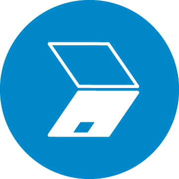

## TonOffers
 Platform prototype for the first hack-a-TON. **Tonoffers** its a platform to connect and stablish a proper tonpayments channel with proffesionals offering goods and services users would love to buy very frequently.
 
# Motivation
Our main reason to build this project for this contest borns from the idea of the task itself "think about the most useful way to implement tonpayments channels"
From our point of view, simply coding a webapp menu to build fast channels between already known users won´t be enough, we want to show the potential of the payment channels in a the most realistic use case possible. That lead us to think about how to connect users that want to sell goods or their services to other users, but making the channel creation, update and close UX as smoth as possible for them.

# Features
+ The best presentational animated video we can made with the limited amount of the contest
+ A webapp dApp that showcases our programming skills
+ A few fake profiles inside the offers gallery to explain the potential of the marketplace and the options for the users, this emulate our backend to display registered offers
+ The payment channel section, that shows the available possibilities for the users when they want to interact through it.

# Useful information
We needed to include a delay line of code inside the tonweb library to reach a better flow, because whenever we sended payments transactions, the provider rejected us due to the small time between calls ands boc transfers

The project has all to work properly, the flow of the channel deployment => topUps => Init => Sign => Verify => Sign => Close => Final Cooperative Close must be polished to have a better UX and to succes with the less interactions as possible from the users

We created several channels and interacted with this wallet on the testnet creating, topUps, Inits, Signs and channel close: 
https://testnet.tonscan.org/address/EQD9sAd94JljOeOYimRMvH7bVJ3mJpfCY6Nye00u4Ip4lQQI

# About the result of the development for this contest
As a team of 2 people, we are really proud of the result, the idea started fuzzy but ended in a nice project with a lot of potential we will continue expanding and coding for sure! 

# About the future of this project
Since we are really happy with the idea, we want to develop more features for this platform, such as a decentralized backend to host the offers users wants us to showcase in our gallery, the active payments channels the users have, notification when someone push an updated channelState, etc. For this we have a few ideas, like implementing gun.js since its decentralized while we wait for **TON STORAGE**. Any feedback or idea its welcome, and we invite you to submit it to our telegram accounts or here in the issue section!
